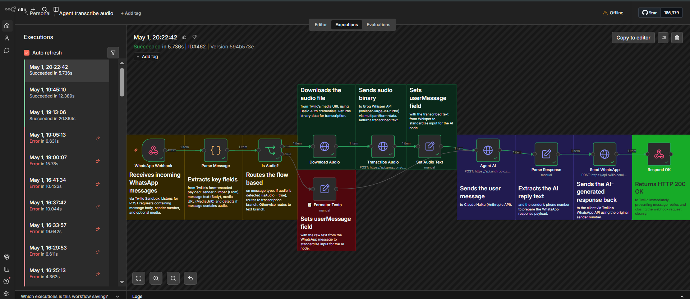

# WhatsApp Voice AI Agent — Myelon AI

> Conversational AI agent that handles voice messages, FAQs, and appointment booking via WhatsApp — fully automated, 24/7.

## 🎙️ Demo

- [Watch demo (EN)](https://github.com/1thai8/whatsapp-voice-ai-agent/assets/demo-EN.mp4)

---

## ✨ What it does

- Receives WhatsApp messages (text and audio)
- Transcribes voice messages using Groq Whisper
- Answers FAQs from a Google Sheets knowledge base
- Books, reschedules, and cancels appointments via Google Calendar
- Replies in any language via Meta Graph API

---

## 🏗️ Architecture

---

## 🛠️ Tech Stack

| Layer | Tool |
|---|---|
| Automation | n8n (self-hosted) |
| AI / STT | Groq (Whisper + LLaMA) |
| Messaging | Meta WhatsApp Cloud API |
| Calendar | Google Calendar API |
| CRM / FAQ | Google Sheets |

---

## Built by

**Myelon AI** — AI automation agency for aesthetic and dental clinics.